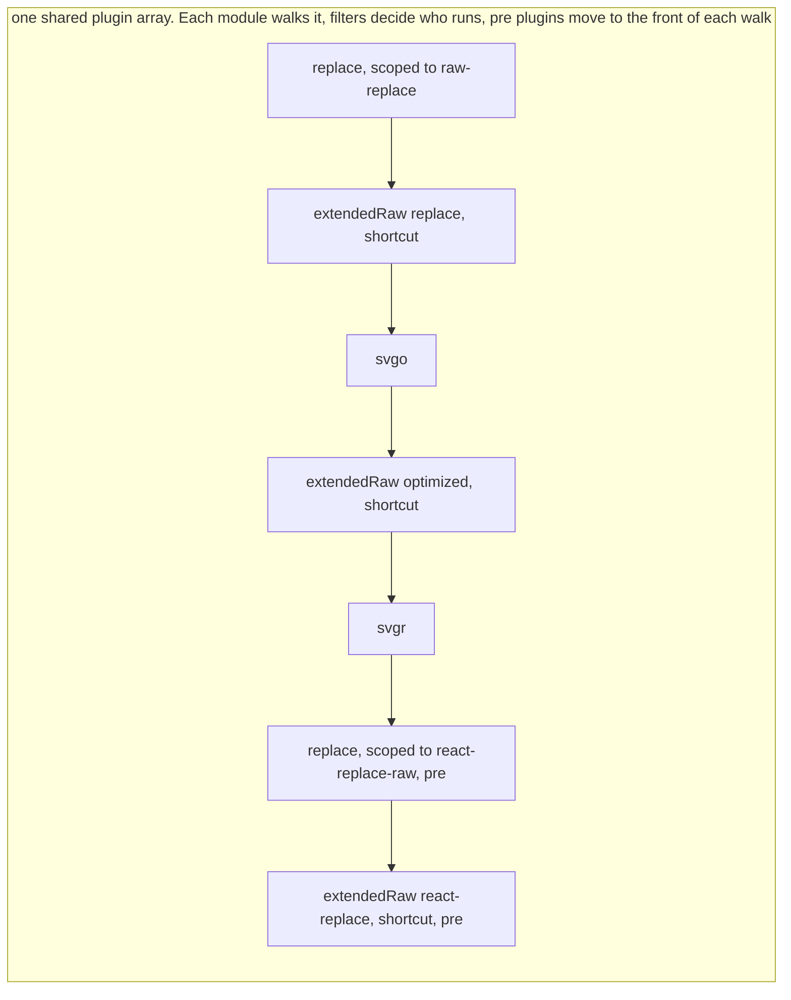

# RFC: Vite transform pipeline, plugin array model

Status: draft.

This document proposes to keep the current `transform` hook chain as the one and only ordering mechanism, and to add a small set of primitives to it so the chain can express scoping, delivery, and `moduleType` changes without guesswork. It is the plugin array model from the discussion in [h-a-n-a/rolldown-rfc#1](https://github.com/h-a-n-a/rolldown-rfc/pull/1), written up on its own.

## Summary

Today, every code change in Vite goes through the `transform` hook chain. Each plugin ships its own filter, and the order of work is the order of the plugin array. This works, but three things are hard:

1. **Scoping.** A plugin author writes one filter for all possible uses of the plugin. When a user needs a new variant (a new query, a new combination), the author's filter misses it, and the author had no way to know it would exist.
2. **Representation.** "How the module is delivered" (raw text, url, data url, JS) is mixed into transform logic, instead of being a separate, declarable fact.
3. **`moduleType` changes.** A plugin can say "this module is now `jsx`", but the code that handles `jsx` only runs if it happens to sit later in the chain. Vite and Rolldown each lower TS and JSX in their own place with their own options, and a plugin that changes the type must know where that place is.

The proposal builds on two Rolldown proposals by sapphi-red:

- [rolldown#10219](https://github.com/rolldown/rolldown/pull/10219): **module conversion.** Conversion (turning content into what the importer gets) becomes one stage after `transform`. `this.load(id)` returns content after `transform` and before conversion.
- [rolldown#10413](https://github.com/rolldown/rolldown/pull/10413): **`moduleType` vs `representType`.** `moduleType` is what the content is (`ts`, `json`, `css`, `svg`). `representType` is what an importer gets (`js`, `text`, `dataurl`, `url`).

On top of these, the proposal adds four primitives to the existing hook model. Everything is additive. No new pipeline, no mode switch, no migration window.

| Primitive | What it does |
|---|---|
| `representType` in the transform result | Declares how the module is delivered, separate from the code change |
| `shortcut: true` in the transform result | Ends the transform chain for this module. Later `transform` hooks do not run |
| `filter: { moduleType }` on the `transform` hook | Matches by module type, not only by id. Plus a Rolldown option that maps extensions to module types |
| Throw-back on `moduleType` change | When a hook returns a new `moduleType`, the module walks the chain again as the new type. The built-in TS and JSX lowering becomes a plugin in the chain |

`withFilter(plugin, filter)` already exists in Rolldown and is the user-side tool to re-scope a plugin from outside.

## Motivation

### Running example: an SVG showcase website

A website shows an SVG icon before and after optimization, and lets visitors copy the icon in several forms: a React component, a data URL, and the raw SVG code before and after optimization.

The page needs five imports of the same file:

```ts
import before from './icon.svg?raw'            // original text, untouched
import after  from './icon.svg?raw-optimized'  // text, after svgo
import url    from './icon.svg?url'            // url, after svgo
import inline from './icon.svg?inline'         // data url, after svgo
import Icon   from './icon.svg?react'          // React component, svgo then svgr
```

The wanted pipeline for each variant:

| Import | Transforms | representType |
|---|---|---|
| `?raw` | (none) | `text` |
| `?raw-optimized` | svgo | `text` |
| `?url` | svgo | `url` |
| `?inline` | svgo | `dataurl` |
| `?react` | svgo → svgr | `js` |

`?raw` and `?url` are Vite internals. `?react` is an internal of the svgr plugin. `?raw-optimized` is a custom query this user invented and no plugin knows about it.

### Why the current model struggles here

With today's `transform` hooks:

- The svgo plugin author follows the Vite convention: match any query except `?raw`, so the filter is `/\.svg(\?(?!raw)\w+)?$/`. This keeps `?raw` untouched without naming `?url` or `?react`.
- The same filter misses the user's `?raw-optimized`. The query starts with `raw`, so the `(?!raw)` check rejects it, and `\w+` does not match the `-`. The author cannot know a query the user invented.
- To support `?raw-optimized`, the user must write a new plugin and copy svgo's transform body into it, or re-scope svgo with `withFilter` and keep the two filters in sync by hand.
- The convention is itself a coupling: every plugin must know about `?raw`, and about any future "deliver as-is" query. It holds only if every author follows it.

So a filter written once by the author cannot fit every use: it is exact for the variants the author knew about, and misses the ones the user adds.

### Asset optimization has no place to run

The `?url` and `?inline` rows in the table above are the interesting ones. Today an `?url` or `?inline` import is handled by the `vite:asset` plugin and never reaches a transform that could change its content. There is no step where svgo, or any optimizer, can run on the asset before it is delivered. Three open Vite issues ask for exactly that:

- [vitejs/vite#20360](https://github.com/vitejs/vite/issues/20360), asset optimization. Today it is done by third-party plugins in `generateBundle`, on the final bundle, after every decision about the asset has been made.
- [vitejs/vite#19945](https://github.com/vitejs/vite/issues/19945), a hook to optimize SVGs before they are inlined as data URLs.
- [vitejs/vite#20070](https://github.com/vitejs/vite/issues/20070), references inside an SVG (`<image href="./img.png">`) are not resolved or rewritten when the SVG becomes an asset.

With `representType` separate from the transform, these become ordinary plugins: an svgo plugin with `filter: { moduleType: 'svg' }` runs on every SVG, and `?url` and `?inline` are only a `representType` set by a later plugin. This RFC does not solve all of #20360 by itself: whole-bundle compression of images that no module imports still belongs to `generateBundle`. And #20070 needs the transform to emit the referenced file as an asset, which `this.emitFile` already allows inside a hook. The point here is smaller: give these optimizations a place in the pipeline, before delivery, that they do not have now.

### A second requirement: order depends on the variant

Two more custom variants show that even the *order* of the same plugins can depend on the import:

- `.svg?raw-replace`: run a string replacement on the raw SVG text: `raw → replace`.
- `.svg?react-replace-raw`: run the replacement on the JSX output, then deliver as text: `svgr → replace → raw`.

The same two steps (`replace`, raw delivery) appear in both, in different orders. A single global plugin order cannot express this without listing a plugin twice. This RFC accepts that, and makes the duplicate cheap: a small wrapper plugin with a different filter.

### A third problem: `moduleType` does not decide what runs today

A plugin can already return `moduleType: 'jsx'` from `transform`. Rolldown records it and later plugins see it in their filter. But nothing else treats it as a fact about the module:

- **Two lowering passes, two configs.** Vite lowers TS, TSX and JSX inside the plugin chain, with `vite:oxc` (a native plugin in bundled dev), using Vite's options: `jsxInject`, React refresh, `include` / `exclude`. Rolldown lowers again after the chain, in core, on the AST, with Rolldown's `transform` options. The two do not know about each other. The only reason both exist is that Vite plugins after `vite:oxc` expect compiled JS, and Rolldown has no other place to put its lowering.
- **Vite's lowering matches by file extension, not by `moduleType`.** For `icon.svg?react`, svgr returns JSX with `moduleType: 'jsx'`. `vite:oxc` skips it, because the extension is `svg`. The JSX is then compiled by Rolldown core with Rolldown's defaults: no refresh, no `jsxInject`, not Vite's JSX runtime settings. A `.jsx` file next to it gets all of them. To get the same result, svgr today imports Vite's `transformWithOxc` and lowers the JSX itself, which duplicates Vite's config inside the plugin.
- **In vanilla Rolldown, nothing can run after the lowering.** The lowering happens in core, after every `transform` hook, and the AST goes straight into the bundler. A plugin that needs the compiled JS of a `.ts` file has no hook to run in. It must lower the file itself, with its own oxc call.
- **Order across types is the plugin author's problem.** A plugin that produces `jsx` must sit before whatever compiles `jsx`, and the author has to know where that is (`enforce: 'pre'` in Vite, nothing in vanilla Rolldown). Returning a `moduleType` does not place the module anywhere.
- **A plugin cannot reuse Vite's internal transform plugin for the part it does not handle.** [`@vitejs/plugin-vue-jsx`](https://github.com/vitejs/vite-plugin-vue/tree/main/packages/plugin-vue-jsx/src) compiles Vue JSX with Babel. That is the only thing it wants to do itself. Everything else in a `.tsx` file, the TypeScript syntax and the target lowering, is exactly what Vite's internal transform plugin does. But the plugin cannot hand the file to that plugin as a next step. It can only steer it from the outside: it edits Vite's `oxc` option in its `config` hook to exclude `.jsx` (so Vite's lowering does not compile the JSX as React), runs its own `transform` with `order: 'pre'` to come first, and for `.tsx` either lets Vite lower the TS afterwards or, when that is not possible, strips TS itself with a Babel plugin. In rolldown-vite the dependency pre-bundle has a separate lowering, so it also sets `optimizeDeps.rolldownOptions.transform.jsx` to `'preserve'`. The reuse the plugin wants, "I do the Vue JSX, Vite does the rest", is not expressible.

The result is that "first-class `moduleType`" today means "a type Rolldown core happens to parse". A type is only handled well when core knows it. Plugins cannot add to that set, and even the types core knows are handled differently in Vite and in Rolldown.

This RFC proposes one rule for this: when a hook changes the `moduleType`, the module is thrown back to the top of the chain and walks it again as the new type. The lowering becomes an ordinary plugin keyed on `moduleType`, shared by Vite and vanilla Rolldown, and the core lowering pass is removed. A `moduleType` is then first-class when some plugin accepts it, whoever provides that plugin. See "Throw-back on `moduleType` change" in the reference section.

Under that rule, plugin-vue-jsx becomes one plugin with `filter: { moduleType: ['jsx', 'tsx'] }` and `enforce: 'pre'`. It compiles the JSX and returns `moduleType: 'ts'` for a `.tsx` input, or `'js'` for `.jsx`. The throw-back then hands the TS part to the built-in lowering. No config rewrite, no pre-bundle option.

The same rule works for types that Rolldown has never heard of. `moduleType` accepts custom names, so a plugin can introduce its own. A future Vue plugin could work like this:

- A `.vue` file gets the type `vue`. The Vue plugin for that type compiles it into JS that imports the blocks as separate modules through queries, the way the plugin does today: `App.vue?vue&type=script`, `App.vue?vue&type=template`, `App.vue?vue&type=style`. It returns `moduleType: 'js'`, so the file is thrown back into the normal JS chain.
- Each of those imports is its own module. When the Vue plugin loads it, it reads the query and gives the module its own type: `vue:script`, `vue:template`, `vue:style`. The plugin ships one `transform` per type, each with a `moduleType` filter. Each module walks the chain as that type, is compiled by its plugin, and returns `moduleType: 'js'` (or `'ts'`, or `'css'`) to be thrown back into the chain for that type.

Because the types are visible in filters, a user can put a plugin in front of the Vue plugin for one block only, for example `{ enforce: 'pre', transform: { filter: { moduleType: 'vue:script' }, handler } }`, and leave the template and style alone. After the Vue plugin returns `js`, the script goes through the built-in lowering and any other plugin whose filter covers it. Nothing in Rolldown core knows what `vue:script` is, and nothing needs to.

## Guide-level explanation

Nothing changes for plugin users in the common case. `plugins: [svgo(), svgr()]` keeps working. Plugin authors gain four small tools, and users gain a way to re-scope any plugin from outside.

### For plugin authors

**Match by `moduleType`, not by query regex.** The svgo plugin no longer needs to know about `?raw`, `?url` or `?react`:

```ts
// vite-plugin-svgo
export default function svgo(opts = {}): Plugin {
  return {
    name: 'vite-plugin-svgo',
    transform: {
      filter: { moduleType: 'svg' },
      handler(code, id) {
        return { code: optimize(code, { path: cleanUrl(id), ...opts }).data }
      },
    },
  }
}
```

**Declare delivery with `representType`.** A plugin that wants "deliver as text and nothing else runs after me" says so in its result:

```ts
// Vite internal: ?raw
{
  name: 'vite:raw',
  transform: {
    filter: { id: /\?raw$/ },
    handler() { return { representType: 'text', shortcut: true } },
  },
}
```

`shortcut: true` ends the chain for this module. Without it, every other plugin would need an `exclude` for `?raw`.

**Return a new `moduleType` and let the chain do the rest.** svgr outputs JSX. It returns `moduleType: 'jsx'` and does not lower the JSX itself:

```ts
// vite-plugin-svgr
export default function svgr(opts = {}): Plugin {
  return {
    name: 'vite-plugin-svgr',
    transform: {
      filter: { id: /\?react$/, moduleType: 'svg' },
      async handler(code, id) {
        const jsx = await svgrTransform(code, opts, { filePath: cleanUrl(id) })
        return { code: jsx, moduleType: 'jsx' }
      },
    },
  }
}
```

The module is thrown back to the top of the chain as `jsx`. Vite's built-in lowering, now a plugin with `filter: { moduleType: ['jsx', 'ts', 'tsx'] }`, compiles it with Vite's JSX options, the same as a `.jsx` file.

**Keep filter logic out of the handler.** The handler must transform every module its `filter` lets through. A handler that checks the id again inside makes `withFilter` useless, because the outer filter can widen the scope but the inner check still rejects the new variant. Plugins that take `include` / `exclude` options should pass them into `filter`, not test them in the handler.

### For users

Most needs are covered by plugins. For a custom variant, the user places small plugins at the right position in the array. `withFilter` re-scopes an existing plugin. A wrapper of a few lines adds a delivery boundary.

The full SVG example, including the two order-dependent variants:

```ts
import svgo from 'vite-plugin-svgo'
import svgr from 'vite-plugin-svgr'
import { withFilter } from 'vite'

// "deliver as text and stop", scoped by a filter
function extendedRaw(name, filter, enforce) {
  return {
    name: `raw-${name}`,
    enforce,
    transform: {
      filter,
      handler() { return { representType: 'text', shortcut: true } },
    },
  }
}

function replace(enforce) {
  return {
    name: 'replace',
    enforce,
    transform: {
      handler(code) { return replaceStep(code) },
    },
  }
}

export default defineConfig({
  plugins: [
    // ?raw-replace: replace on the raw text, then deliver as text
    withFilter(replace(), { transform: { id: /\?raw-replace$/ } }),
    extendedRaw('replace', { id: /\?raw-replace$/, moduleType: 'svg' }),

    svgo(),

    // ?raw-optimized: svgo has run, deliver as text
    extendedRaw('optimized', { id: /\?raw-optimized$/, moduleType: 'svg' }),

    svgr(),

    // ?react-replace-raw: svgr returns jsx and the module is thrown back.
    // In the jsx walk, Vite's jsx compiler runs before user 'normal' plugins.
    // These two are 'pre' so they run first. shortcut then ends the walk and
    // the JSX is delivered as text, not compiled.
    withFilter(replace('pre'), { transform: { id: /\?react-replace-raw$/, moduleType: 'jsx' } }),
    extendedRaw('react-replace', { id: /\?react-replace-raw$/, moduleType: 'jsx' }, 'pre'),
  ],
})
```

What runs for each import:

```
?raw                svg walk:  vite:raw (shortcut)                                   -> text
?raw-optimized      svg walk:  svgo -> extendedRaw optimized (shortcut)              -> text
?url                svg walk:  svgo -> vite:asset sets representType 'url'           -> url
?inline             svg walk:  svgo -> vite:asset sets representType 'dataurl'       -> dataurl
?react              svg walk:  svgo -> svgr returns jsx, throw back
                    jsx walk:  vite lowering -> js                                    -> js
?raw-replace        svg walk:  replace -> extendedRaw replace (shortcut)             -> text
?react-replace-raw  svg walk:  svgr returns jsx, throw back
                    jsx walk:  replace (pre) -> extendedRaw react-replace (pre, shortcut). lowering never runs -> text
```



### Vite internals under this model

The internal plugins that handle delivery become ordinary plugins in the same array, at the positions the `vite:asset` plugin has today:

```
after 'pre' transforms, before 'normal' transforms
  vite:raw         filter.id /\?raw$/               representType 'text', shortcut
  vite:asset-url   filter.id ASSET_RE (no query)    representType 'url'
  vite:lowering    filter.moduleType [jsx, ts, tsx] returns moduleType 'js'

after 'normal' transforms, so ?url and ?inline see the normal transform results
  vite:asset-url     filter.id /\?url$/     representType 'url'
  vite:asset-inline  filter.id /\?inline$/  representType 'dataurl'
```

## Reference-level explanation

### `representType`

A field in the `transform` result. It declares how the importer receives the module: `'js'`, `'text'`, `'url'`, `'dataurl'`, and any other value the conversion stage from rolldown#10219 supports. It is separate from `code`. A hook may return only `representType` and leave the code untouched.

Every hook that sets it overwrites the previous value. The last one set wins. When no hook sets it, the default follows the final `moduleType`: script types are delivered as `js`, and the existing Rolldown defaults apply to the rest.

For extension-based cases, like `.vert` shader files that should always be text, Rolldown gains an option that maps an extension to a `representType`, next to the existing `moduleTypes` option that maps an extension to a `moduleType`. No plugin is needed for these.

### `shortcut: true`

A field in the `transform` result. When returned, the chain for this module ends at this plugin. No later `transform` hook runs on it, in this walk or in any later walk. The module goes to the conversion stage with the current `code`, `moduleType` and `representType`.

This is the primitive that lets a "raw" plugin protect its scope without every other plugin adding an `exclude`. It also acts as a scope boundary inside the array: everything before the shortcut plugin is the pipeline for that scope.

Open question (see below): whether `shortcut` also skips `enforce: 'post'` plugins and Vite internals.

### `moduleType` filters

`transform.filter` accepts `moduleType`, a string or a list of strings, next to the existing `id` and `code` filters. All given conditions must match. The filter is checked against the module's current `moduleType` at the time the hook would run, so a filter on `jsx` matches a module that svgr just turned into `jsx`.

The Rolldown `moduleTypes` option already maps extensions to types. Vite sets `svg` and the other asset extensions there, so `filter: { moduleType: 'svg' }` works out of the box.

### `withFilter`

`withFilter(plugin, filter)` wraps an existing plugin and replaces the filter of a named hook from the outside: `withFilter(replace(), { transform: { id: /\?raw-replace$/ } })`. This is the user-side answer to "the author's filter does not fit my variant". It exists in Rolldown today, see the [`withFilter` reference](https://rolldown.rs/reference/Function.withFilter#function-withfilter).

It only works when the plugin keeps its filter logic in `filter`, not in the handler. See "Keep filter logic out of the handler" above.

### Throw-back on `moduleType` change

A hook may return a new `moduleType`, the same way it can today. The driver then starts a new walk of the array from the top, with the new type:

- The current walk stops at the hook that changed the type. Plugins after it in this walk do not run on the old type.
- A new walk starts from the first plugin, with the new `moduleType`. Filters on the old type no longer match. Filters on the new type now match, wherever the plugin sits in the array.
- The driver skips every hook it already invoked on this module. This is bookkeeping inside the driver, not an option. Without it, a plugin matched by id only (`filter: { id: /\.svg$/ }`) or a plugin with no filter would run once per type.
- If a walk returns a `moduleType` the module already had, the driver reports an error. This stops loops.
- `shortcut` ends everything, including further walks.
- `representType` is not tied to a walk. The last value set across all walks wins.

Because of the throw-back, order across types does not matter. svgr does not need `enforce: 'pre'` to sit before the lowering plugin. The lowering plugin runs on `jsx` whenever svgr produces it. Order within one type still follows the array.

Order within one type still matters. The built-in lowering is a plugin for `ts`, `tsx` and `jsx`, and it changes the type. A plugin for the same type that needs the source form must be placed before it, with `enforce: 'pre'`, as the React compiler plugin is today.

Example with a plain TypeScript file, one user plugin for `ts`, one for `js`, and one matched by path only:

```
array:
  licenseHeader    filter.id /\/src\//            (any type)
  stripDecorators  filter.moduleType 'ts'
  vite:lowering    filter.moduleType [jsx, ts, tsx]
  addBanner        filter.moduleType 'js'

src/app.ts:
  ts walk:   licenseHeader -> stripDecorators -> vite:lowering returns 'js' -> throw back
             (addBanner: type js, no match)
  js walk:   licenseHeader: matches by path, already invoked -> skip
             stripDecorators, vite:lowering: type ts, no match
             addBanner -> done
  executed:  licenseHeader -> stripDecorators -> vite:lowering -> addBanner
```

Two different things keep plugins out of the second walk. `stripDecorators` and `vite:lowering` are out because their filters are for `ts` and the module is now `js`. `licenseHeader` still matches, because its filter checks only the path, and it is skipped only because the driver already invoked it. Without the skip rule the header would be added twice.

The same file today in vanilla Rolldown runs `licenseHeader` and `stripDecorators`, and `addBanner` never runs. The throw-back with the lowering as a plugin closes that gap: `addBanner` runs on the lowered JS in Vite and in Rolldown.

### Built-in lowering as a plugin

The TS, TSX and JSX to JS conversion becomes an ordinary plugin in the array, keyed on `moduleType`, for Vite and for vanilla Rolldown. Today Vite already does this in bundled dev with a native plugin, and Rolldown core does it separately in `parse_to_ecma_ast`. With this RFC the core step is removed. Core no longer lowers TS or JSX. A script module that reaches core must already be `js`. Other types core handles today (`json`, `text`, `dataurl`, and so on) are not affected. One plugin, one set of options, one position in the chain for both.

The lowering plugin must match on `moduleType`, not on the file extension. This is what lets `icon.svg?react` get the same JSX options as `Icon.jsx`.

Cost: a string-based lowering plugin parses, lowers and prints the code, and core then parses the printed JS again. For Vite this is what happens today. For vanilla Rolldown it would add one codegen and one parse per TS, TSX or JSX file, compared to parsing once and keeping the AST.

To avoid that, the driver carries the lowering plugin's output as an AST and prints it to a string only when a later hook needs a string. A `.ts` file with no string-based `js` plugin after the lowering then costs the same as today: one parse, no codegen. The extra codegen and parse are paid only by modules that a string hook touches after the lowering. The throw-back itself is free when no hook that has not run yet matches the new type.

### Hook signature

The `transform` hook keeps its signature. The result gains two optional fields:

```ts
interface TransformResult {
  code?: string
  map?: SourceMap
  moduleType?: string        // exists today
  representType?: string     // new
  shortcut?: boolean         // new
}
```

`transform.filter` gains one optional field:

```ts
interface TransformHookFilter {
  id?: StringFilter
  code?: StringFilter
  moduleType?: string | string[]   // new
}
```

## Drawbacks

- **The effective pipeline stays implicit.** Answering "what runs on `foo.svg?react-replace-raw`" means walking the array, evaluating every filter, and knowing who shortcuts. There is no single place that shows the full story for one scope.
- **Order and scope tuning falls on the user.** Wrapper plugins must sit at exactly the right positions, and a wrong position fails silently: a step does not run, or runs on the wrong variant. `enforce: 'pre'` is still needed when a user plugin must run before a Vite internal in the same type, as in the `?react-replace-raw` case.
- **Every new variant costs a plugin.** Even a `representType`-only need (`?raw-optimized` is only "svgo output, delivered as text") requires a wrapper plugin, unless the Rolldown extension-mapping option covers the case.
- **Runtime cost.** Every extra JS wrapper plugin is another Rust to JS to Rust round trip per matching module. Filters run on the Rust side, so a plugin whose filter does not match costs nothing. But the wrapper pattern multiplies plugins that do match. This is not measured yet.
- **Filter guessing is reduced, not gone.** The author still writes one filter for all uses. `moduleType` filters remove most of the query guessing, and `withFilter` lets users re-scope. But a variant outside the author's filter still sends the user back to `withFilter` plus wrappers.

## Rationale and alternatives

**Why additive primitives.** The `resolveId`, `load`, `transform` scheme is understood by a very large number of plugin authors, and the cost of starting a first plugin is low. A second transform system next to it would mean a long window where Vite internals and major plugins ship two shapes, and where one un-migrated plugin holds a whole project on the old path. Each primitive here helps the moment one plugin adopts it: `representType` separates delivery from transform logic, `moduleType` filters end query-regex guessing, `shortcut` protects a scope without excludes everywhere, `withFilter` re-scopes any plugin from outside. Nothing has to move together.

**Why `moduleType` and `representType` are the core.** Together they solve the "too narrow / too broad filter" problem on their own. svgo can match `moduleType: 'svg'` and never think about queries. `?raw`, `?url` and `?inline` become delivery facts set by internals, not exclusions every author must remember.

**Why duplication is accepted.** Variant-dependent order (`?raw-replace` vs `?react-replace-raw`) needs the same step listed twice in any design that has one global order. The question is only how cheap the duplicate is. Here it is a wrapper of about eight lines, placed in the array.

**Why filters must leave the handler.** This is a real requirement on plugin authors, and the one behavior change this RFC asks of the ecosystem. Without it `withFilter` cannot widen a plugin's scope, and `moduleType` filters cannot narrow it reliably. Plugins that take `include` / `exclude` options, a Rollup convention, should pass them into `filter`.

**Alternative considered: a declared per-scope pipeline in config.** A table where each entry names the files, the ordered steps, and the `representType` for one scope, shipped by plugins as presets and extended by users in config. It makes the per-scope story readable in one line and lets users add a variant without writing a plugin. It was set aside because it is a second transform system: it needs a legacy versus new mode, a long dual-support window, new concepts (append versus replace between entries, a second `enforce` level) that apply to no other hook, and its benefits arrive only after every plugin in a project has migrated. The discussion is recorded in [h-a-n-a/rolldown-rfc#1](https://github.com/h-a-n-a/rolldown-rfc/pull/1).

**Possible follow-up: a helper that returns several plugins.** Part of the "one line per variant" benefit can be given back to users without a new pipeline: a helper in the style of `withFilter`, or of `perEnvironmentPlugin`, that takes a plugin and a scope description and returns the wrapper plugins already ordered. The user still decides where the helper's output sits in the array. This is listed under future work and should be designed against the `?react-replace-raw` case, the hardest one.

## Prior art

- **Rollup / current Vite `transform` chain**: this RFC is a conservative extension of it, in the same spirit as the hook filters that rolldown-vite already added.
- **Rolldown `moduleType`**: the existing extension to module type mapping is the base this RFC builds on. The proposed `representType` option mirrors it.
- **esbuild loaders**: a per-extension "how is this content interpreted" setting, a simpler ancestor of `representType`.
- **webpack `module.rules`**: the declared per-scope alternative. It shows that a rules table works at scale, and also that rule matching has its own learning curve.

## Unresolved questions

- **`shortcut` semantics.** Does it also skip `enforce: 'post'` plugins and Vite internals? If it skips internals, a user shortcut can bypass `vite:asset` and the module must still reach the conversion stage correctly. If it does not, "raw" cannot fully protect its scope.
- **Performance.** Measure the actual Rust to JS round-trip cost of the extra wrapper plugins on real projects, instead of assuming it. This is the condition several reviewers attached to the model.
- **Lowering cost in vanilla Rolldown.** Measure the extra codegen and parse per TS file once the lowering is a plugin, with and without the "skip throw-back when nothing matches" rule and the AST carry-over.
- **Asset optimization scope.** The chain gives per-module asset transforms a place before delivery. Whole-bundle image compression (vitejs/vite#20360) stays in `generateBundle`. Rewriting references inside an asset (vitejs/vite#20070) needs `this.emitFile` from inside `transform` on an asset module, which needs to be confirmed to work for a module that ends with `representType: 'url'`.
- **Already invoked, for a hook that returned nothing.** The skip rule counts a hook as invoked when the driver called it. Whether a hook that returned `null` should be eligible again in a later walk needs a decision.
- **`representType` default.** What the default is for a custom `moduleType` that no plugin converts, and whether it should be an error.

## Future work

- **Helper returning an array of plugins.** See "Possible follow-up" above.
- **Native filters for `moduleType`.** Make sure `moduleType` filters are evaluated on the Rust side like `id` filters, so a non-matching JS plugin costs no round trip.
- **Migration notes for plugin authors.** A short guide: move `include` / `exclude` into `filter`, match by `moduleType` instead of query regex, return `moduleType` instead of lowering in the plugin, return `representType` instead of building a JS module string by hand.
- **`load` and `resolveId`.** They stay as they are. Whether `moduleType` filters should also apply to `load` is out of scope here.
