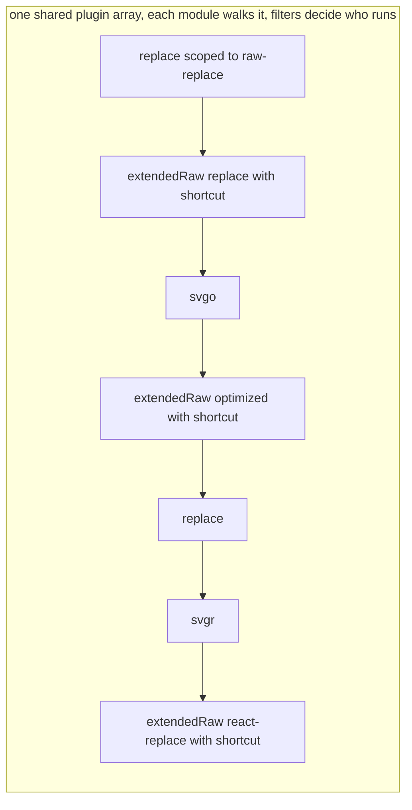

# RFC: Vite transformer pipeline

Status: draft, for #stack discussion.

This document proposes the **declared composition model**: declare per-scope transform pipelines in config, outside of plugin hooks. It also includes, in full, the alternative **plugin array model** (sapphi-red): keep the current `transform` hook chain and add a few small primitives (`representType`, `shortcut`, `withFilter`, moduleType filters) so the chain can express the same things. The two are compared at the end so we can decide which way to go.

## Summary

Today, every code change in Vite goes through the `transform` hook chain. Each plugin ships its own filter, and the order of work is the order of the plugin array. This works, but two things are hard:

1. **Scoping.** A plugin author writes one filter for all possible uses of the plugin. When a user needs a new variant (a new query, a new combination), the author's filter is either too narrow (misses the variant) or too broad (catches things it should not touch).
2. **Representation.** "How the module is delivered" (raw text, url, data url, JS) is mixed into transform logic, instead of being a separate, declarable fact.

The proposal builds on two Rolldown proposals by sapphi-red:

- [rolldown#10219](https://github.com/rolldown/rolldown/pull/10219): **module conversion.** Conversion (turning content into what the importer gets) becomes one stage after `transform`; `this.load(id)` returns content after `transform` and before conversion.
- [rolldown#10413](https://github.com/rolldown/rolldown/pull/10413): **`moduleType` vs `representType`.** `moduleType` = what the content is (`ts`, `json`, `css`, `svg`). `representType` = what an importer gets (`js`, `text`, `dataurl`, `url`).

And on two ideas:

- **Transformer step**: a pure function `(id, code) => { code, sourcemap?, moduleType? }`. No filter inside; it only transforms.
- **representType**: a declared output representation (`'js'`, `'text'`, `'url'`, `'dataurl'`, ...), separate from the transform itself (the concept from rolldown#10413 above).

On top of these, filters and order move out of plugin bodies into a declared `transformer` table. Plugins ship the table as a preset, and user config can extend or override it per scope. The alternative plugin array model keeps filters and order inside the plugin array, and gives users tools (`withFilter`, `shortcut`, small wrapper plugins) to re-scope and re-order; it shares the same two base ideas.

## Motivation

### Running example: an SVG showcase website

A website shows an SVG icon before and after optimization, and lets visitors copy the icon in several forms: a React component, a data URL, and the raw SVG code before and after optimization.

The page needs five imports of the same file:

```ts
import before from './icon.svg?raw'            // original text, untouched
import after  from './icon.svg?raw-optimized'  // text, after svgo
import url    from './icon.svg?url'            // url, after svgo
import inline from './icon.svg?inline'         // data url, after svgo
import Icon   from './icon.svg?react'          // React component, svgo then svgr
```

The wanted pipeline for each variant:

| Import | Transformers | representType |
|---|---|---|
| `?raw` | (none) | `text` |
| `?raw-optimized` | svgo | `text` |
| `?url` | svgo | `url` |
| `?inline` | svgo | `dataurl` |
| `?react` | svgo → svgr | `js` |

`?raw` and `?url` are Vite internals. `?react` is an internal of the svgr plugin. `?raw-optimized` is a custom query this user invented and no plugin knows about it.

### Why the current model struggles here

With today's `transform` hooks:

- The svgo plugin author must guess a filter like `/\.svg(\?(url|inline|react))?$/`. This couples svgo to Vite's `?url` and svgr's `?react`. And it still misses the user's `?raw-optimized`.
- To support `?raw-optimized`, the user must write a new plugin and copy svgo's transform body into it.
- To keep `?raw` untouched, every plugin must add an `exclude`, or an early-bailout signal must exist, which is not supported and the raw handling must run before all user plugins.

So the filter is always either too narrow (misses `?raw-optimized`) or too broad (catches `?raw`).

### A second requirement: order depends on the variant

Two more custom variants show that even the *order* of the same plugins can depend on the import:

- `.svg?raw-replace`: run a string replacement on the raw SVG text: `raw → replace`.
- `.svg?react-replace-raw`: run the replacement on the JSX output, then deliver as text: `svgr → replace → raw`.

The same two steps (`replace`, raw delivery) appear in both, in different orders. A single global plugin order cannot express this without duplication. Both models accept duplication; the question is which side makes it easier to read and control.

## Guide-level explanation

A plugin can declare a `transformer` table: a list of scoped pipelines. Each entry matches modules (by path, query, or moduleType) and names the exact transformer steps and the representType for that scope.

```ts
transformer: [
  { test: /\.svg$/, query: /^raw-optimized$/, transformer: [svgo()],         representType: 'text' },
  { test: /\.svg$/, query: /^raw$/,           transformer: [],               representType: 'text' },
  { test: /\.svg$/, query: /^react$/,         transformer: [svgo(), svgr()], representType: 'js' },
  { test: /\.svg$/, query: /^inline$/,        transformer: [svgo()],         representType: 'dataurl' },
  { test: /\.svg$/, query: /^url$/,           transformer: [svgo()],         representType: 'url' },
]
```

Reading one line tells you the full story for one scope: which files, which steps, in which order, delivered how. The table is static data, so tools (devtools, docs) can analyze it without running anything.

Users do not write this table for common cases. Plugins ship it as a preset (`plugins: [svgo(), svgr()]` keeps working). The top-level `transformer` config in `vite.config` exists for the custom cases: it extends or overrides the plugins' presets.

The full SVG example. First, the updated plugins export their pure steps:

```ts
// vite-plugin-svgo
export function svgoStep(code, id) {
  return { code: optimize(code, { path: cleanUrl(id), ...opts }).data }
}
export default function svgo(opts = {}): Plugin {
  return {
    name: 'vite-plugin-svgo',
    transform: { filter: { id: /\.svg$/ }, handler: svgoStep }, // legacy mode
    transformer: [
      { moduleType: 'svg', transformer: [svgoStep] },
    ],
  }
}

// vite-plugin-svgr
export async function svgrStep(code, id) {
  const jsx = await svgrTransform(code, svgrOptions, { filePath: cleanUrl(id), caller: { defaultPlugins: [jsxPlugin] } })
  return { code: jsx, moduleType: 'jsx' } // output is JSX
}
export default function svgr(opts = {}): Plugin {
  return {
    name: 'vite-plugin-svgr',
    transform: { filter: { id: /\.svg\?react$/ }, handler: svgrStep }, // legacy mode
    transformer: [
      // 'pre' so the oxc transform (JSX → JS) applies after svgr
      { moduleType: 'svg', query: /^react$/, enforce: 'pre', transformer: [svgrStep] },
    ],
  }
}
```

Then the user config only adds the custom variants:

```ts
import svgo, { svgoStep } from 'vite-plugin-svgo'
import svgr, { svgrStep } from 'vite-plugin-svgr'

export default defineConfig({
  plugins: [svgo(), svgr()], // most demands are covered by the plugin presets
  transformer: [
    // ?raw-optimized: the svgo preset already matches moduleType 'svg', only the representType is new
    { moduleType: 'svg', query: /^raw-optimized$/, representType: 'text' },

    // ?raw-replace: raw text → replace, no svgo wanted, so start a fresh pipeline
    { moduleType: 'svg', query: /^raw-replace$/, transformer: [replaceStep], representType: 'text' },

    // ?react-replace-raw: svgr → replace, delivered as text, a fresh pipeline again
    { moduleType: 'svg', query: /^react-replace-raw$/, transformer: [svgrStep, replaceStep], representType: 'text' },
  ],
})
```

These custom variants are run after the plugin transformer preset, thus, giving more space for users to handle the result from the plugin presets.
Inside `transformer:`, the token `'...'` stands for "everything already matched so far", in this case, `myStep` is appended to the already matched transformers:
```js
transformer: [
  { moduleType: 'svg', transformer: ['...', prevStep] },
  { moduleType: 'svg', transformer: ['...', myStep] }
]
```
In the example above, module whose moduleType is svg runs both transformers.

Without the token `'...'` means replacing the matched pipeline:
```js
transformer: [
  { moduleType: 'svg', transformer: ['...', prevStep] },
  { moduleType: 'svg', transformer: [myStep] }
]
``` 
For this example, module whose moduleType is svg runs only `myStep`, ignoring all prior entries including Vite internals. This lets a user build a fully custom scoped pipeline with zero knowledge of Vite internals.

Vite's own internals become entries in the same table (near where the `vite:asset` plugin sits today):

```ts
// after 'pre' transforms, before 'normal' transforms
{ test: ASSET_RE,                 representType: 'url'  }
{ test: ASSET_RE, query: /^raw$/, representType: 'text' }
{ moduleType: ['js', 'jsx', 'ts', 'tsx'], transformer: [oxcStep], representType: 'js' }

// after 'normal' transforms, so ?url and ?inline see the normal transform results
{ test: ASSET_RE, query: /^url$/,    representType: 'url'     }
{ test: ASSET_RE, query: /^inline$/, representType: 'dataurl' }
```

## Reference-level explanation

**Matching.** A `transformer` entry can match by `test` / `include` / `exclude` (path, matched without the query), `query`, and `moduleType`. All given conditions must match.

**Pipeline assembly.** For a given module, entries are collected in declaration order: `[...pluginPresets, ...userConfigTransformer]`, with `enforce` extracted the same way plugin hooks are today. The current chain

```
[...user plugins 'pre', ...vite plugins, ...user plugins 'normal', ...vite plugins, ...user plugins 'post', ...other vite plugins]
```

becomes, with every transform extracted:

```
[...user transformers 'pre', ...vite transformers, ...user transformers 'normal', ...vite transformers, ...user transformers 'post', ...other vite transformers]
```

`enforce` on a `transformer` entry positions that entry in this sequence; it is independent from the plugin's own `enforce`.

**Append vs replace.** Matched entries are folded in order. An entry whose `transformer` list contains `'...'` splices the pipeline matched so far at that position (append/wrap). An entry without `'...'` discards the pipeline matched so far and starts fresh. An entry with no `transformer` key changes only `representType` and keeps the matched pipeline. Example:

```ts
plugins: [pluginA()], // preset: { moduleType: 'svg', transformer: [transformA()] }
transformer: [
  { moduleType: 'svg', transformer: ['...', transformB()] },
  { moduleType: 'svg', transformer: ['...', transformC()] },
  { query: /\?foo/,    transformer: ['...', transformD()] },
  { moduleType: 'svg', query: /special/, transformer: [transformSpecial()] }, // fresh pipeline
  { moduleType: 'svg', transformer: [transformE()] },                          // fresh pipeline, svg now runs only transformE
]
```

For `foo.svg?foo` (without the last two lines) the order is A → B → C → D. With the last line present, every svg module runs only `transformE`. A later replacing entry wins over everything before it.

**Modes and migration.** The adaptation is based on two modes, `legacy` and `transformer`:

- Per plugin (Vite internals included): has a `transformer` config → `transformer`; has only a `transform` hook → `legacy`.
- Project mode, decided after checking every plugin: all plugins `transformer` → transformer mode; any plugin `legacy` → legacy mode.
- `experimental.transformer = true` forces transformer mode and throws if any plugin is `legacy` (useful for CI testing).

The mode is a bundler-level flag, not per module. A mixed per-module model was considered and rejected: which `legacy` plugin runs is unknown until its `transform` hook actually executes, so the effective order would be impossible to predict.

Vite internal plugins support both `transformer` and the `transform` hook for a long time (until Vite 9 or so). A new plugin that ships only `transformer` is not backward compatible with older Vite.

**A real plugin under this model.** `@vitejs/plugin-react` keeps both shapes side by side:

```ts
export default function viteReact(opts) {
  return [
    { name: 'vite:react-babel', /* ... */ },
    {
      name: 'vite:react:refresh-wrapper',
      apply: 'serve',
      transform() { /* original transform, legacy mode */ },
      transformer: [
        // include/exclude match the path without the query, like `test`
        // '...' appends refreshWrapper to the matched pipeline
        { test: opts.include, exclude: opts.exclude, transformer: ['...', refreshWrapper] },
      ],
    },
    opts.compiler && {
      name: 'vite:react-compiler',
      enforce: 'pre', // plugin enforce, does not apply to the transformer entries
      transform: { filter: { id: { include, exclude } }, handler: reactCompiler },
      transformer: [
        { test: opts.include, exclude: opts.exclude, transformer: ['...', reactCompile], enforce: 'pre' },
      ],
    },
    // other plugins
  ]
}
```

Plugin users still write `plugins: [react()]` and nothing else.

## Alternative proposal: plugin array model (sapphi-red)

Keep the `transform` hook and the plugin array as the one ordering mechanism. Add small primitives so the array can express everything the table above expresses:

- **representType**: declared inside the plugin, in the transform result (e.g. `return { representType: 'text', shortcut: true }`).
- **`shortcut: true`**: an early-bailout signal in a transform result: "the pipeline ends here, later transforms do not run on this module."
- **`withFilter(plugin, filter)`**: a user-side wrapper that rewrites a plugin's filters from outside.
- **moduleType filters**: `filter: { moduleType: 'svg' }` matches by module type, not only by id. Rolldown gains an option to map extensions to module types (like it already has for cases such as `.vert`).

The full SVG example in this model. The user writes two small helper plugins and places everything in the right order:

```ts
import svgo from 'vite-plugin-svgo'
import svgr from 'vite-plugin-svgr'

// a "deliver as text and stop" plugin, scoped by a filter
function extendedRaw(name, filter) {
  return function () {
    return {
      name: `raw-${name}`,
      transform: {
        filter,
        handler(code) { return { representType: 'text', shortcut: true } }
      }
    }
  }
}

function replace() {
  return {
    name: 'replace',
    transform: {
      handler(code) { code = replaceStep(code); return code }
    }
  }
}

export default defineConfig({
  plugins: [
    withFilter(replace(), { transform: { id: /\?raw-replace/ } }),
    extendedRaw('replace', { id: /\?raw-replace/, moduleType: 'svg' }),
    svgo(),
    extendedRaw('optimized', { id: /\?raw-optimized/, moduleType: 'svg' }),
    replace(),
    svgr(),
    extendedRaw('react-replace', { id: /\?react-replace-raw/, moduleType: 'js' })
  ],
})
```

For the built-in variants, the ordering plan (with `shortcut` available) is:

1. raw plugin: `filter.id: /\?raw/`, `representType: 'text'`, `shortcut: true` (end the transform here)
2. svg optimization plugin: `filter.moduleType: 'svg'`
3. (custom) raw-optimized plugin: `filter.id: /\?raw-optimized/`, `representType: 'text'`, `shortcut: true`
4. react svg plugin: `filter.id: /\?react/` + `filter.moduleType: 'svg'`, outputs `moduleType: 'jsx'`, `representType: 'js'`
5. url plugin: `filter.id: /\?url/`, `representType: 'url'`
6. inline plugin: `filter.id: /\?inline/`, `representType: 'base64'`

The variant-dependent order (`?raw-replace` needs `raw → replace`, `?react-replace-raw` needs `svgr → replace → raw`) is solved by **duplicating** a plugin with two different filters:

```
rawPlugin (filter ?raw-replace) → svgReactPlugin → replacePlugin → rawPlugin (filter ?react-replace-raw)
```



Semantics of the alternative, in detail:

- **`shortcut: true`.** A transform result field. When returned, the pipeline for this module ends at this plugin; no later `transform` hook runs on it. This is the primitive that lets a "raw" plugin protect its scope without every other plugin adding an `exclude`.
- **`representType`.** Declared inside the plugin, per transform result. For extension-based cases (like `.vert`), an option in Rolldown similar to the existing `moduleType` mapping should cover it without a plugin.
- **`withFilter`.** 
	- Wraps an existing plugin and replaces the filter of a named hook from the outside: `withFilter(replace(), { transform: { id: /\?raw-replace/ } })`. This is the user-side answer to "the author's filter does not fit my variant". 
	- Plugin author needs to make sure that each `transform` hook handlers do not contain any filtering logic, otherwise it will make `transform.filter` not working as expected.
- **Ordering.** The plugin array is the only order. Variant-dependent orders are expressed by inserting the same plugin (or a small wrapper like `extendedRaw`) more than once with different filters. `shortcut` plugins act as scope boundaries inside the array.
- **Cost note.** Each plugin in the array is a separate hook call. When transforms run in Rust (Rolldown) and plugins are JS, every extra plugin is another Rust → JS → Rust round trip for the modules it matches. The declared model groups a scope's steps into one declared pipeline, which gives the native side the whole plan up front.

## Pros and cons

### Declared composition model

Pros, ranked:

1. **Per-scope readability.** One entry tells the whole story for one variant: match, steps, order, representation. `{ moduleType: 'svg', query: /^react-replace-raw$/, transformer: [svgrStep, replaceStep], representType: 'text' }` is the complete answer to "what runs on this import".
2. **Users extend without writing plugins.** A new variant like `?raw-optimized` is one config line reusing an exported step. No wrapper plugin, no copying a plugin body, no array position to find.
3. **Escape hatch with zero internal knowledge.** `transformer: [x]` (no `'...'`) starts a fresh pipeline for that scope. A user can fully own one scope without knowing what Vite internals or other plugins would have done to it.
4. **Static analysis.** The table is data. Devtools can show the exact pipeline for `icon.svg?react` as a pure config read, without executing anything.
5. **Performance shape.** The native side gets the whole plan up front. An all-native scope (oxc, svgo-in-Rust some day) can run with zero Rust to JS round trips.
6. **The strategic point.** The plugin array model already needs filter and `shortcut` moved out of plugin bodies to handle the hard cases (a plugin that bails out eagerly kills `rawPlugin → replacePlugin` inside plugin code). Once that refactor is accepted, the declared model is the direct end state, not a bigger step.

Cons, ranked:

1. **Churn.** A second transform system next to the existing one. Vite internals ship both shapes for years, plugin authors migrate, docs split across two modes.
2. **Learning curve.** People that are not familiar with this requires to learn the new transform pipline. Need to know that it's a standalone pipeline.
3. **Author-side duplication.** A plugin that ships only `transformer` breaks on older Vite, so authors carry both hooks side by side for a long time.
4. **Merge rules are unproven.** Merge rules should be explicitly documented. This is something that might confuse people when implementing your custom transformer pipeline and interacting with the plugin transformer presets.

### Plugin array model

Pros, ranked:

1. **No churn, no migration.** Everything is additive to the current model. No mode split, no dual-support window. This is the decisive difference for adoption cost.
2. **Benefits land incrementally.** Each primitive helps the moment one plugin adopts it: `representType` separates delivery from transform logic, `moduleType` filters end query-regex guessing, `shortcut` protects a scope without excludes everywhere, `withFilter` re-scopes any plugin from outside.
3. **One mental model, already learned.** Order is the plugin array everyone knows. No second ordering system, no append-vs-replace rule, no two-level `enforce`.
4. **Hard cases stay expressible, at low cost.** Variant-dependent order works by duplicating a small wrapper plugin with two filters, and a wrapper like `extendedRaw` is about eight lines.
5. **The declared model duplicates too.** Its variant rows also repeat steps, so duplication is not an advantage it holds over the array.

Cons, ranked:

1. **The effective pipeline stays implicit.** Answering "what runs on `foo.svg?react-replace-raw`" means walking the array, evaluating every filter, and knowing who shortcuts. Devtools must execute to show it.
2. **Order and scope tuning falls on the user.** Wrapper plugins must sit at exactly the right positions, and a wrong position fails silently: a step just does not run, or runs on the wrong variant.
3. **Every new variant costs a plugin.** Even a representType-only need (`?raw-optimized` is just "svgo output, delivered as text") requires a wrapper plugin, unless the Rolldown-level extension option covers the case.
4. **Runtime cost.** Every extra JS wrapper plugin is another Rust → JS → Rust round trip per matching module, and the wrapper pattern multiplies plugins. Unmeasured so far; benchmark before treating it as fact.
5. **Filter guessing is reduced, not gone.** The author still writes one filter for all uses. A variant outside it sends the user back to `withFilter` plus wrappers.

### The shape of the trade

The two cost profiles are different in kind, which is why the decision is genuinely open:

| | Declared composition | Plugin array |
|---|---|---|
| Cost now | High: migration, learning, dual support | Near zero: fully additive |
| Cost per custom use case | Low: one config line | Recurring: wrapper plugin + position tuning + round trips |
| Pipeline visibility | Written down as data | Emergent from array walk |
| When benefits arrive | Only after full migration | Immediately, per plugin |

## Drawbacks

- **Churn.** A second transform system next to the existing one: internals maintain both shapes for years, plugin authors migrate, docs and the ecosystem split across two modes. This is the main objection.
- **Learning cost.** Users and authors must learn the entry shape, the `'...'` append-vs-replace rule, and the two-level `enforce`. The replace semantics ("a plain `transformer: [x]` silently drops everything matched before, Vite internals included") is easy to misread. In the design discussion it was misread once even by the reviewers.
- **All-or-nothing mode.** One `legacy` plugin puts the whole project in legacy mode, so the benefits only arrive once every plugin in a project has migrated.

## Rationale and alternatives

Points established in the design discussion:

- **`moduleType` + `representType` solve the "too narrow / too broad filter" problems on their own.** Both models include them. The remaining disagreement is only about where order and scope control live.
- **Duplication happens in both models.** Variant-dependent order (`?raw-replace` vs `?react-replace-raw`) needs the same step listed twice either way. So duplication is not a point for either side; the question is where the duplicate is easier to write and read.
- **Filters need to be placed out of the transform handler.** Both models require user to put filter logic out of the transform handler. This should be migrated in both models. Otherwise, the filter inside might narrow down the scope of module transform.
- **The declared model's duplication is scoped and local**: one config line per variant, readable as "this scope runs these steps". It effectively creates multiple scoped pipelines. But this only works because filters and `shortcut` moved out of the plugins. Inside plugins, `rawPlugin → replacePlugin` cannot work, because rawPlugin bails out eagerly. If we move filter and shortcut out of plugins anyway, that is already most of the refactor, which is an argument for going all the way to the declared model.
- **The plugin array model's duplication is positional**: insert wrapper plugins at the right array positions. It reuses everything the ecosystem already knows, but tuning order and scope by array position and filters is expected to be a common source of user confusion.
- **Static analysis.** The declared table is data; devtools can show the exact pipeline per scope without executing plugins. The plugin array's effective pipeline is only known by evaluating filters and `shortcut` results.
- **Compatibility.** The plugin array model is incremental: every addition is additive to the current hook model. The declared model needs the legacy/transformer mode machinery and a long dual-support window.

Drawbacks of the alternative plugin array model:

- **Filter fit is still the author's guess, softened but not removed.** `moduleType` filters and `representType` remove most of the coupling (svgo can just match `moduleType: 'svg'`), and `withFilter` lets users re-scope. But users still express new variants by writing plugins.
- **RepresentType-only needs still cost a plugin** unless the Rolldown-level option covers the case.
- **Order is positional and implicit.** The reader must walk the array, track each filter, and know which plugins `shortcut`, to know what runs on `foo.svg?react-replace-raw`. Scoped duplication (`extendedRaw` twice, `replace` twice) makes the array longer and the per-scope story harder to see.
- **Runtime cost.** More small JS plugins means more Rust ↔ JS round trips per module.

Positions at the end of the discussion:

- sapphi-red: the churn of the declared model is too large compared to the benefit; the conditions for considering it are met (users do not have to touch `transformer` in common cases, and the complexity is understandable), but the default preference is the plugin array model. Take it to #stack for more opinions.
- andrew: once filters and `shortcut` move out of plugin bodies (which the plugin array model needs for the hard cases anyway), the declared model is the more direct end state, and it avoids users hand-tuning plugin order and filters.

## Prior art

- **webpack `module.rules`**: declared, per-scope pipelines: `test` + ordered `use: [loaders]` + `type`. The declared composition model is close to this shape (with `moduleType`/`representType` instead of webpack's `type`, and plugin-shipped presets). webpack shows both that the model works at scale and that rule matching has its own learning curve.
- **Rollup / current Vite `transform` chain**: the plugin array model is a conservative extension of it, in the same spirit as the hook filters that rolldown-vite already added.
- **Rolldown `moduleType`**: the existing extension → module type mapping is the base both models build on; the proposed `representType` option mirrors it.
- **esbuild loaders**: a per-extension "how is this content interpreted" setting; a simpler ancestor of `representType`.

## Unresolved questions

- **Migration window**: for the declared model, how long do Vite internals and major plugins keep both shapes (Vite 9?), and what does the `experimental.transformer` error UX look like?
- **In the alternative model, `shortcut` semantics**: does it also skip `enforce: 'post'` transforms and internal ones?
- **Performance**: measure the actual Rust ↔ JS round-trip cost of the plugin array model's extra wrapper plugins vs the declared pipelines, instead of assuming it.

## Future work

- **Devtools**: a per-scope pipeline view ("what exactly runs on `icon.svg?react`"). The declared model makes this a pure config read; under the plugin array model it needs filter evaluation.
- **Native execution**: with a declared pipeline, scopes whose steps are all native (oxc, svgo-in-Rust some day) can run fully on the Rust side with no JS round trip.
- **Migration tooling**: a codemod or a compatibility report ("these plugins keep your project in legacy mode") to help projects reach transformer mode.
- **Extending the model beyond `transform`**: `load` and `resolveId` stay hook-based for now; whether declared composition should ever cover them is out of scope here.
