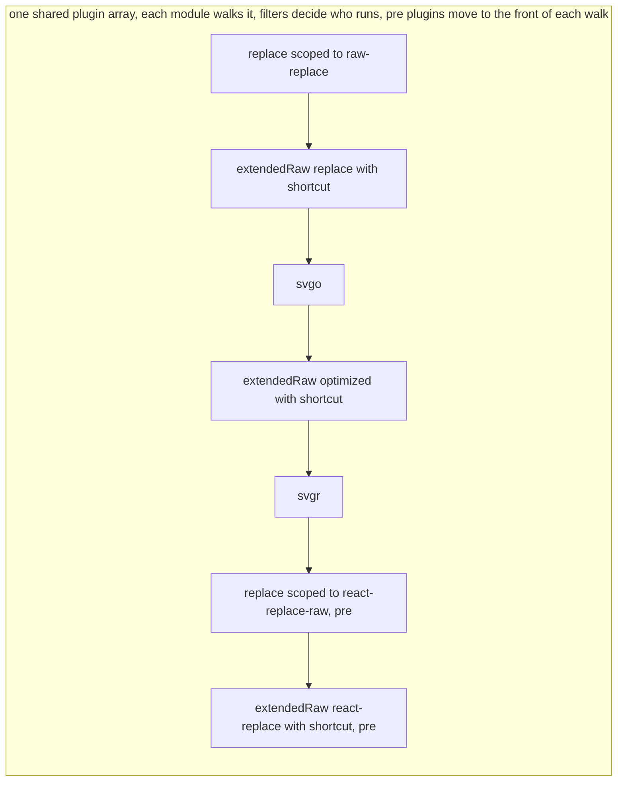

# RFC: Vite transformer pipeline

Status: draft, for #stack discussion.

This document proposes the **declared composition model**: declare per-scope transform pipelines in config, outside of plugin hooks. It also includes, in full, the alternative **plugin array model** (sapphi-red): keep the current `transform` hook chain and add a few small primitives (`representType`, `shortcut`, moduleType filters) so the chain can express the same things. The two are compared at the end so we can decide which way to go.

## Summary

Today, every code change in Vite goes through the `transform` hook chain. Each plugin ships its own filter, and the order of work is the order of the plugin array. This works, but three things are hard:

1. **Scoping.** A plugin author writes one filter for all possible uses of the plugin. When a user needs a new variant (a new query, a new combination), the author's filter misses it, and the author had no way to know it would exist.
2. **Representation.** "How the module is delivered" (raw text, url, data url, JS) is mixed into transform logic, instead of being a separate, declarable fact.
3. **`moduleType` changes.** A plugin can say "this module is now `jsx`", but the code that handles `jsx` only runs if it happens to sit later in the chain. Vite and Rolldown each lower TS and JSX in their own place with their own options, and a plugin that changes the type must know where that place is.

The proposal builds on two Rolldown proposals by sapphi-red:

- [rolldown#10219](https://github.com/rolldown/rolldown/pull/10219): **module conversion.** Conversion (turning content into what the importer gets) becomes one stage after `transform`; `this.load(id)` returns content after `transform` and before conversion.
- [rolldown#10413](https://github.com/rolldown/rolldown/pull/10413): **`moduleType` vs `representType`.** `moduleType` = what the content is (`ts`, `json`, `css`, `svg`). `representType` = what an importer gets (`js`, `text`, `dataurl`, `url`).

And on three ideas:

- **Transformer step**: a pure function `(code, id) => { code, sourcemap?, moduleType? }`. No filter inside; it only transforms.
- **representType**: a declared output representation (`'js'`, `'text'`, `'url'`, `'dataurl'`, ...), separate from the transform itself (the concept from rolldown#10413 above).
- **Throw-back on `moduleType` change**: when a step returns a new `moduleType`, the module goes back to the top of the pipeline and walks it again as the new type. The TS and JSX lowering becomes an ordinary entry keyed on `moduleType`, shared by Vite and vanilla Rolldown. Both models use this rule.

On top of these, filters and order move out of plugin bodies into a declared `transformer` table. Plugins ship the table as a preset, and user config can extend or override it per scope. The alternative plugin array model keeps filters and order inside the plugin array, and gives users tools (`withFilter`, `shortcut`, small wrapper plugins) to re-scope and re-order; it shares the same three base ideas.

## Motivation

### Running example: an SVG showcase website

A website shows an SVG icon before and after optimization, and lets visitors copy the icon in several forms: a React component, a data URL, and the raw SVG code before and after optimization.

The page needs five imports of the same file:

```ts
import before from './icon.svg?raw'            // original text, untouched
import after  from './icon.svg?raw-optimized'  // text, after svgo
import url    from './icon.svg?url'            // url, after svgo
import inline from './icon.svg?inline'         // data url, after svgo
import Icon   from './icon.svg?react'          // React component, svgo then svgr
```

The wanted pipeline for each variant:

| Import | Transformers | representType |
|---|---|---|
| `?raw` | (none) | `text` |
| `?raw-optimized` | svgo | `text` |
| `?url` | svgo | `url` |
| `?inline` | svgo | `dataurl` |
| `?react` | svgo → svgr | `js` |

`?raw` and `?url` are Vite internals. `?react` is an internal of the svgr plugin. `?raw-optimized` is a custom query this user invented and no plugin knows about it.

### Why the current model struggles here

With today's `transform` hooks:

- The svgo plugin author follows the Vite convention: match any query except `?raw`, so the filter is `/\.svg(\?(?!raw)\w+)?$/`. This keeps `?raw` untouched without naming `?url` or `?react`.
- The same filter misses the user's `?raw-optimized`. The query starts with `raw`, so the `(?!raw)` check rejects it, and `\w+` does not match the `-`. The author cannot know a query the user invented.
- To support `?raw-optimized`, the user must write a new plugin and copy svgo's transform body into it, or re-scope svgo with `withFilter` and keep the two filters in sync by hand.
- The convention is itself a coupling: every plugin must know about `?raw`, and about any future "deliver as-is" query. It holds only if every author follows it.

So a filter written once by the author cannot fit every use: it is exact for the variants the author knew about, and misses the ones the user adds.

### Asset optimization has no place to run

The `?url` and `?inline` rows in the table above are the interesting ones. Today an `?url` or `?inline` import is handled by the `vite:asset` plugin and never reaches a transform that could change its content. There is no step where svgo, or any optimizer, can run on the asset before it is delivered. Three open Vite issues ask for exactly that:

- [vitejs/vite#20360](https://github.com/vitejs/vite/issues/20360), asset optimization. Today it is done by third-party plugins in `generateBundle`, on the final bundle, after every decision about the asset has been made.
- [vitejs/vite#19945](https://github.com/vitejs/vite/issues/19945), a hook to optimize SVGs before they are inlined as data URLs.
- [vitejs/vite#20070](https://github.com/vitejs/vite/issues/20070), references inside an SVG (`<image href="./img.png">`) are not resolved or rewritten when the SVG becomes an asset.

With `representType` separate from the transform, these become ordinary entries: `{ moduleType: 'svg', transformer: ['...', svgoStep] }` runs svgo on every SVG, and `?url` and `?inline` are only a `representType` on top of that. The RFC does not solve all of #20360 by itself: whole-bundle compression of images that no module imports still belongs to `generateBundle`. And #20070 needs the step to emit the referenced file as an asset, which a pure `(code, id)` step cannot do today. Both are listed under unresolved questions. The point here is smaller: give these optimizations a place in the pipeline, before delivery, that they do not have now.

### A second requirement: order depends on the variant

Two more custom variants show that even the *order* of the same plugins can depend on the import:

- `.svg?raw-replace`: run a string replacement on the raw SVG text: `raw → replace`.
- `.svg?react-replace-raw`: run the replacement on the JSX output, then deliver as text: `svgr → replace → raw`.

The same two steps (`replace`, raw delivery) appear in both, in different orders. A single global plugin order cannot express this without duplication. Both models accept duplication; the question is which side makes it easier to read and control.

### A third problem: `moduleType` does not decide what runs today

A plugin can already return `moduleType: 'jsx'` from `transform`. Rolldown records it and later plugins see it in their filter. But nothing else treats it as a fact about the module:

- **Two lowering passes, two configs.** Vite lowers TS, TSX and JSX inside the plugin chain, with `vite:oxc` (a native plugin in bundled dev), using Vite's options: `jsxInject`, React refresh, `include` / `exclude`. Rolldown lowers again after the chain, in core, on the AST, with Rolldown's `transform` options. The two do not know about each other. The only reason both exist is that Vite plugins after `vite:oxc` expect compiled JS, and Rolldown has no other place to put its lowering.
- **Vite's lowering matches by file extension, not by `moduleType`.** For `icon.svg?react`, svgr returns JSX with `moduleType: 'jsx'`. `vite:oxc` skips it, because the extension is `svg`. The JSX is then compiled by Rolldown core with Rolldown's defaults: no refresh, no `jsxInject`, not Vite's JSX runtime settings. A `.jsx` file next to it gets all of them. To get the same result, svgr today imports Vite's `transformWithOxc` and lowers the JSX itself, which duplicates Vite's config inside the plugin.
- **In vanilla Rolldown, nothing can run after the lowering.** The lowering happens in core, after every `transform` hook, and the AST goes straight into the bundler. A plugin that needs the compiled JS of a `.ts` file has no hook to run in. It must lower the file itself, with its own oxc call.
- **Order across types is the plugin author's problem.** A plugin that produces `jsx` must sit before whatever compiles `jsx`, and the author has to know where that is (`enforce: 'pre'` in Vite, nothing in vanilla Rolldown). Returning a `moduleType` does not place the module anywhere.
- **A plugin cannot reuse Vite's internal transform plugin for the part it does not handle.** [`@vitejs/plugin-vue-jsx`](https://github.com/vitejs/vite-plugin-vue/tree/main/packages/plugin-vue-jsx/src) compiles Vue JSX with Babel. That is the only thing it wants to do itself. Everything else in a `.tsx` file, the TypeScript syntax and the target lowering, is exactly what Vite's internal transform plugin does. But the plugin cannot hand the file to that plugin as a next step. It can only steer it from the outside: it edits Vite's `oxc` option in its `config` hook to exclude `.jsx` (so Vite's lowering does not compile the JSX as React), runs its own `transform` with `order: 'pre'` to come first, and for `.tsx` either lets Vite lower the TS afterwards or, when that is not possible, strips TS itself with a Babel plugin. In rolldown-vite the dependency pre-bundle has a separate lowering, so it also sets `optimizeDeps.rolldownOptions.transform.jsx` to `'preserve'`. The reuse the plugin wants, "I do the Vue JSX, Vite does the rest", is not expressible.

The result is that "first-class `moduleType`" today means "a type Rolldown core happens to parse". A type is only handled well when core knows it. Plugins cannot add to that set, and even the types core knows are handled differently in Vite and in Rolldown.

The RFC proposes one rule for this: when a step changes the `moduleType`, the module is thrown back to the top of the pipeline and walks it again as the new type. The lowering becomes an ordinary transformer entry keyed on `moduleType`, shared by Vite and vanilla Rolldown, and the core lowering pass is removed. A `moduleType` is then first-class when some transformer entry accepts it, whoever provides that entry. See "When a step changes `moduleType`" and "Built-in lowering as a transformer entry" in the reference section.

Under that rule, plugin-vue-jsx is one entry: `{ moduleType: ['jsx', 'tsx'], transformer: [vueJsxStep] }`. No `'...'`, so it replaces the built-in lowering for those two types. `vueJsxStep` compiles the JSX and returns `moduleType: 'ts'` for a `.tsx` input, or `'js'` for `.jsx`. The throw-back then hands the TS part to the built-in lowering. No config rewrite, no `order: 'pre'`, no pre-bundle option.

The same rule works for types that Rolldown has never heard of. `moduleType` accepts custom names, so a plugin can introduce its own. A future Vue plugin could work like this:

- A `.vue` file gets the type `vue`. The Vue entry for that type compiles it into JS that imports the blocks as separate modules through queries, the way the plugin does today: `App.vue?vue&type=script`, `App.vue?vue&type=template`, `App.vue?vue&type=style`. It returns `moduleType: 'js'`, so the file is thrown back into the normal JS pipeline.
- Each of those imports is its own module. When the Vue plugin loads it, it reads the query and gives the module its own type: `vue:script`, `vue:template`, `vue:style`. The plugin ships one entry per type. Each module walks the pipeline as that type, is compiled by its entry, and returns `moduleType: 'js'` (or `'ts'`, or `'css'`) to be thrown back into the pipeline for that type.

Because the types are visible in the table, a user can put a step in front of the Vue plugin for one block only, for example `{ moduleType: 'vue:script', transformer: ['...', myStep] }` with `enforce: 'pre'`, and leave the template and style alone. After the Vue entry returns `js`, the script goes through the built-in lowering and any other entry whose match covers it. Nothing in Rolldown core knows what `vue:script` is, and nothing needs to.

## Guide-level explanation

A plugin can declare a `transformer` table: a list of scoped pipelines. Each entry matches modules (by path, query, or moduleType) and names the exact transformer steps and the representType for that scope.

```ts
transformer: [
  { test: /\.svg$/, query: /^raw-optimized$/, transformer: [svgo()],         representType: 'text' },
  { test: /\.svg$/, query: /^raw$/,           transformer: [],               representType: 'text' },
  { test: /\.svg$/, query: /^react$/,         transformer: [svgo(), svgr()], representType: 'js' },
  { test: /\.svg$/, query: /^inline$/,        transformer: [svgo()],         representType: 'dataurl' },
  { test: /\.svg$/, query: /^url$/,           transformer: [svgo()],         representType: 'url' },
]
```

Reading one line tells you the full story for one scope: which files, which steps, in which order, delivered how.

Users do not write this table for common cases. Plugins ship it as a preset (`plugins: [svgo(), svgr()]` keeps working). The top-level `transformer` config in `vite.config` / `rolldown.config` exists for the custom cases: it extends or overrides the plugins' presets.

The full SVG example. First, the updated plugins export their pure steps:

```ts
// vite-plugin-svgo
export function svgoStep(code, id) {
  return { code: optimize(code, { path: cleanUrl(id), ...opts }).data }
}
export default function svgo(opts = {}): Plugin {
  return {
    name: 'vite-plugin-svgo',
    transform: { filter: { id: /\.svg$/ }, handler: svgoStep }, // legacy mode
    transformer: [
      { moduleType: 'svg', transformer: [svgoStep] },
    ],
  }
}

// vite-plugin-svgr
export async function svgrStep(code, id) {
  const jsx = await svgrTransform(code, svgrOptions, { filePath: cleanUrl(id), caller: { defaultPlugins: [jsxPlugin] } })
  return { code: jsx, moduleType: 'jsx' } // output is JSX
}
export default function svgr(opts = {}): Plugin {
  return {
    name: 'vite-plugin-svgr',
    transform: { filter: { id: /\.svg\?react$/ }, handler: svgrStep }, // legacy mode
    transformer: [
      // svgr returns moduleType 'jsx'. The module is then thrown back to the top of the
      // pipeline and the built-in lowering entry compiles the JSX (see "When a step changes moduleType").
      { moduleType: 'svg', query: /^react$/, transformer: [svgrStep] },
    ],
  }
}
```

Then the user config only adds the custom variants:

```ts
import svgo, { svgoStep } from 'vite-plugin-svgo'
import svgr, { svgrStep } from 'vite-plugin-svgr'

export default defineConfig({
  plugins: [svgo(), svgr()], // most demands are covered by the plugin presets
  transformer: [
    // ?raw-optimized: the svgo preset already matches moduleType 'svg', only the representType is new
    { moduleType: 'svg', query: /^raw-optimized$/, representType: 'text' },

    // ?raw-replace: raw text → replace, no svgo wanted, so start a fresh pipeline
    { moduleType: 'svg', query: /^raw-replace$/, transformer: [replaceStep], representType: 'text' },

    // ?react-replace-raw: svgr → replace, delivered as text. Two entries, one per moduleType:
    // svgr turns the module into jsx, and the jsx entry replaces the built-in lowering for this query
    { moduleType: 'svg', query: /^react-replace-raw$/, transformer: [svgrStep] },
    { moduleType: 'jsx', query: /^react-replace-raw$/, transformer: [replaceStep], representType: 'text' },
  ],
})
```

These custom variants are run after the plugin transformer preset, thus, giving more space for users to handle the result from the plugin presets.
Inside `transformer:`, the token `'...'` stands for "everything already matched so far", in this case, `myStep` is appended to the already matched transformers:
```js
transformer: [
  { moduleType: 'svg', transformer: ['...', prevStep] },
  { moduleType: 'svg', transformer: ['...', myStep] }
]
```
In the example above, module whose moduleType is svg runs both transformers.

Without the token `'...'` means replacing the matched pipeline:
```js
transformer: [
  { moduleType: 'svg', transformer: ['...', prevStep] },
  { moduleType: 'svg', transformer: [myStep] }
]
``` 
For this example, module whose moduleType is svg runs only `myStep`, ignoring all prior entries for `svg` including Vite internals. This lets a user build a fully custom scoped pipeline with zero knowledge of Vite internals.

Vite's own internals become entries in the same table (near where the `vite:asset` plugin sits today):

```ts
// after 'pre' transforms, before 'normal' transforms
{ test: ASSET_RE,                 representType: 'url'  }
{ test: ASSET_RE, query: /^raw$/, representType: 'text' }
// built-in lowering: TS, TSX and JSX to JS. '...' keeps the steps matched before it (svgr, for example)
{ moduleType: ['jsx', 'ts', 'tsx'], transformer: ['...', oxcStep] }
{ moduleType: 'js', representType: 'js' }

// after 'normal' transforms, so ?url and ?inline see the normal transform results
{ test: ASSET_RE, query: /^url$/,    representType: 'url'     }
{ test: ASSET_RE, query: /^inline$/, representType: 'dataurl' }
```

## Reference-level explanation

**Matching.** A `transformer` entry can match by `test` / `include` / `exclude` (path, matched without the query), `query`, and `moduleType`. All given conditions must match.

**Pipeline assembly.** For a given module, entries are collected in declaration order: `[...pluginPresets, ...userConfigTransformer]`, with `enforce` extracted the same way plugin hooks are today. The current chain

```
[...user plugins 'pre', ...vite plugins, ...user plugins 'normal', ...vite plugins, ...user plugins 'post', ...other vite plugins]
```

becomes, with every transform extracted:

```
[...user transformers 'pre', ...vite transformers, ...user transformers 'normal', ...vite transformers, ...user transformers 'post', ...other vite transformers]
```

`enforce` on a `transformer` entry positions that entry in this sequence; it is independent from the plugin's own `enforce`.

**Append vs replace.** Matched entries are collected in order. An entry whose `transformer` list contains `'...'` splices the pipeline matched so far at that position (append/wrap). An entry without `'...'` discards the pipeline matched so far and starts fresh. An entry with no `transformer` key changes only `representType` and keeps the matched pipeline. Example:

```ts
plugins: [pluginA()], // preset: { moduleType: 'svg', transformer: [transformA()] }
transformer: [
  { moduleType: 'svg', transformer: ['...', transformB()] },
  { moduleType: 'svg', transformer: ['...', transformC()] },
  { query: /\?foo/,    transformer: ['...', transformD()] },
  { moduleType: 'svg', query: /special/, transformer: [transformSpecial()] }, // fresh pipeline
  { moduleType: 'svg', transformer: [transformE()] },                          // fresh pipeline, svg now runs only transformE
]
```

For `foo.svg?foo` (without the last two lines) the order is A → B → C → D. With the last line present, every svg module runs only `transformE`. A later replacing entry wins over everything before it.

The collected list is not always the executed list. It is what runs until the first step that changes the `moduleType`. From that step on, the rules below decide what runs. `'...'` only sets the order inside one collection; it does not decide whether the steps after a type change still run.

**When a step changes `moduleType`.** A step may return a new `moduleType` at run time, the same way a `transform` hook does today (svgr returns `jsx` for an `svg` input). The pipeline is then collected again from the top:

- The walk for the module stops at the step that changed the type. The steps collected after it are dropped.
- A new walk starts from the first entry, with the new `moduleType`. Entries for the old type no longer match. Entries for the new type now match, wherever they sit in the order.
- The driver skips every entry it already invoked on this module. This is bookkeeping inside the driver, not an option. Without it, an entry matched by id only (`test: /\.svg$/`) or an entry with no condition would run once per type.
- If a walk returns a `moduleType` the module already had, the driver reports an error. This stops loops.
- The throw-back applies to every entry, with or without `'...'`. `'...'` only decides whether the steps matched so far are inherited.
- `representType` is not tied to a walk. Every matched entry that sets it overwrites the previous value, across all walks, and the last one set wins. For `icon.svg?react`, the svgr preset does not set it, and the internal `js` entry sets `'js'` in the last walk. For `?react-replace-raw`, the user's `jsx` entry sets `'text'` and nothing later overwrites it.

Because of the throw-back, order across types does not matter. svgr does not need `enforce: 'pre'` to sit before the lowering entry; the lowering entry runs on `jsx` whenever svgr produces it. Order within one type still follows the declaration order.

Order within one type still matters. The built-in lowering is an entry for `ts`, `tsx` and `jsx`, and it changes the type. An entry for the same type that needs the source form must be placed before it, with `enforce: 'pre'`, as the react-compiler entry below is.

Guidance for authors: put each step in an entry for the `moduleType` it operates on. A step that works on JSX belongs in a `jsx` entry, not after svgr inside an `svg` entry. The steps placed after a type-changing step are dropped, wherever `'...'` sits: `[svgrStep, '...']` drops the collected svg steps, `['...', svgrStep]` keeps them. If the step is in an entry for the right type, the throw-back places it correctly and no guessing is needed.

A scope that spans two types is written as two entries, one per type. `?react-replace-raw` wants svgr, then a replacement on the JSX, delivered as text, with no lowering:

```ts
{ moduleType: 'svg', query: /^react-replace-raw$/, transformer: [svgrStep] }
{ moduleType: 'jsx', query: /^react-replace-raw$/, transformer: [replaceStep], representType: 'text' }
```

```
collect, type svg:  svgrStep                  (fresh entry, no svgo)
run svgrStep         -> jsx, throw back
collect, type jsx:  the built-in lowering entry matches first,
                    then the user's jsx entry has no '...' and replaces it: replaceStep
run replaceStep      no type change, done
delivered: JSX text with the replacement, oxc never ran
```

Writing it as one entry, `{ moduleType: 'svg', ..., transformer: [svgrStep, replaceStep] }`, does not work: svgr changes the type, `replaceStep` is dropped, and the lowering runs.

A converted module is treated the same as a real file of that type. `icon.svg?react` after svgr goes through the same `jsx` entries as `Icon.jsx` does: the built-in lowering, and any plugin entry whose match covers it. Entries that match by path, like plugin-react's `include`, cover it only if the path pattern does; entries that match by `moduleType` always do. Today it does not, because Vite's compiler matches on the file extension (`.jsx`, `.tsx`), not on `moduleType`, so the JSX from svgr is compiled by Rolldown core with Rolldown's defaults instead. Matching on `moduleType` in the built-in lowering is a prerequisite for this section.

Example with a plain TypeScript file, one user step for `ts`, one for `js`, and one matched by path only:

```ts
{ test: /\/src\//, transformer: ['...', licenseHeader] }          // user, matches by path, any type
{ moduleType: 'ts', transformer: ['...', stripDecorators] }        // user
{ moduleType: ['jsx', 'ts', 'tsx'], transformer: ['...', oxcStep] } // built-in lowering
{ moduleType: 'js', transformer: ['...', addBanner] }              // user
```

For `src/app.ts`:

```
collect, type ts:   licenseHeader, stripDecorators, oxcStep   (addBanner: type js, no match)
run licenseHeader     no type change
run stripDecorators   no type change
run oxcStep           returns moduleType 'js'                 -> throw back
collect, type js:   licenseHeader: matches by path, but already invoked -> skip
                    stripDecorators, oxcStep: type ts, no match
                    addBanner
run addBanner         no type change                          -> done
executed: licenseHeader -> stripDecorators -> oxcStep -> addBanner
```

Two different things keep steps out of the second walk. `stripDecorators` and `oxcStep` are out because their entries are for `ts` and the module is now `js`. `licenseHeader` still matches, because its entry checks only the path, and it is skipped only because the driver already invoked it. Without the skip rule the header would be added twice.

The same file today in vanilla Rolldown runs `licenseHeader` and `stripDecorators`, and `addBanner` never runs. There is no way to run a transform on the JS that comes out of the built-in TS, TSX or JSX lowering. The lowering happens in core, after every `transform` hook, on the AST, and the AST goes straight into the bundler. A plugin that needs compiled JS must do the lowering itself, with its own oxc call and its own options. This is the gap between Vite and Rolldown today: Vite lowers inside the plugin chain, so a later plugin sees JS; Rolldown lowers after the chain, so no plugin ever does. The throw-back with the lowering as a transformer entry closes it: `addBanner` runs on the lowered JS in both.

**Built-in lowering as a transformer entry.** The TS, TSX and JSX to JS conversion becomes an ordinary entry in the table, keyed on `moduleType`, for Vite and for vanilla Rolldown. Today Vite already does this in bundled dev with a native plugin, and Rolldown core does it separately in `parse_to_ecma_ast`. With this RFC the core step is removed. Core no longer lowers TS or JSX; a script module that reaches core must already be `js`. Other types core handles today (`json`, `text`, `dataurl`, and so on) are not affected. One plugin, one set of options, one position in the pipeline for both.

Cost: a string-based lowering entry parses, lowers and prints the code, and core then parses the printed JS again. For Vite this is what happens today. For vanilla Rolldown it would add one codegen and one parse per TS, TSX or JSX file, compared to parsing once and keeping the AST.

To avoid that, the driver carries the lowering entry's output as an AST and prints it to a string only when a later step needs a string. A `.ts` file with no string-based `js` step after the lowering then costs the same as today: one parse, no codegen. The extra codegen and parse are paid only by scopes that use a string step after the lowering, and a step that accepts an AST avoids them as well. The throw-back itself is free when no entry that has not run yet matches the new type.

**Modes and migration.** The adaptation is based on two modes, `legacy` and `transformer`:

- Per plugin (Vite internals included): has a `transformer` config → `transformer`; has only a `transform` hook → `legacy`.
- Project mode, decided after checking every plugin: all plugins `transformer` → transformer mode; any plugin `legacy` → legacy mode.
- `experimental.transformer = true` forces transformer mode and throws if any plugin is `legacy` (useful for CI testing).

The mode is a bundler-level flag, not per module. A mixed per-module model was considered and rejected: which `legacy` plugin runs is unknown until its `transform` hook actually executes, so the effective order would be impossible to predict.

Vite internal plugins support both `transformer` and the `transform` hook for a long time (until Vite 9 or so). A new plugin that ships only `transformer` is not backward compatible with older Vite.

**A real plugin under this model.** `@vitejs/plugin-react` keeps both shapes side by side:

```ts
export default function viteReact(opts) {
  return [
    { name: 'vite:react-babel', /* ... */ },
    {
      name: 'vite:react:refresh-wrapper',
      apply: 'serve',
      transform() { /* original transform, legacy mode */ },
      transformer: [
        // include/exclude match the path without the query, like `test`
        // '...' appends refreshWrapper to the matched pipeline
        { test: opts.include, exclude: opts.exclude, transformer: ['...', refreshWrapper] },
      ],
    },
    opts.compiler && {
      name: 'vite:react-compiler',
      enforce: 'pre', // plugin enforce, does not apply to the transformer entries
      transform: { filter: { id: { include, exclude } }, handler: reactCompiler },
      transformer: [
        // 'pre' so it runs before the built-in lowering, on the source form
        { test: opts.include, exclude: opts.exclude, transformer: ['...', reactCompile], enforce: 'pre' },
      ],
    },
    // other plugins
  ]
}
```

Plugin users still write `plugins: [react()]` and nothing else.

## Alternative proposal: plugin array model (sapphi-red)

Keep the `transform` hook and the plugin array as the one ordering mechanism. Add small primitives so the array can express everything the table above expresses:

- **representType**: declared inside the plugin, in the transform result (e.g. `return { representType: 'text', shortcut: true }`).
- **`shortcut: true`**: an early-bailout signal in a transform result: "the pipeline ends here, later transforms do not run on this module."
- **`withFilter(plugin, filter)`**: a user-side wrapper that rewrites a plugin's filters from outside, which has been implemented [here](https://rolldown.rs/reference/Function.withFilter#function-withfilter).
- **moduleType filters**: `filter: { moduleType: 'svg' }` matches by module type, not only by id. Rolldown gains an option to map extensions to module types (like it already has for cases such as `.vert`).

The full SVG example in this model. The user writes two small helper plugins and places everything in the right order:

```ts
import svgo from 'vite-plugin-svgo'
import svgr from 'vite-plugin-svgr'

// a "deliver as text and stop" plugin, scoped by a filter
function extendedRaw(name, filter, enforce) {
  return {
    name: `raw-${name}`,
    enforce,
    transform: {
      filter,
      handler(code) { return { representType: 'text', shortcut: true } }
    }
  }
}

function replace(enforce) {
  return {
    name: 'replace',
    enforce,
    transform: {
      handler(code) { code = replaceStep(code); return code }
    }
  }
}

export default defineConfig({
  plugins: [
    withFilter(replace(), { transform: { id: /\?raw-replace/ } }),
    extendedRaw('replace', { id: /\?raw-replace/, moduleType: 'svg' }),
    svgo(),
    extendedRaw('optimized', { id: /\?raw-optimized/, moduleType: 'svg' }),
    svgr(),
    // svgr returns jsx and the module is thrown back. In the jsx walk, Vite's jsx compiler
    // (a Vite core plugin) runs before user 'normal' plugins. These two are 'pre' so they
    // run first; shortcut then ends the walk and the JSX is delivered as text, not compiled.
    withFilter(replace('pre'), { transform: { id: /\?react-replace-raw/, moduleType: 'jsx' } }),
    extendedRaw('react-replace', { id: /\?react-replace-raw/, moduleType: 'jsx' }, 'pre'),
  ],
})
```

For the built-in variants, the ordering plan (with `shortcut` available) is:

1. raw plugin: `filter.id: /\?raw/`, `representType: 'text'`, `shortcut: true` (end the transform here)
2. svg optimization plugin: `filter.moduleType: 'svg'`
3. (custom) raw-optimized plugin: `filter.id: /\?raw-optimized/`, `representType: 'text'`, `shortcut: true`
4. react svg plugin: `filter.id: /\?react/` + `filter.moduleType: 'svg'`, outputs `moduleType: 'jsx'`, `representType: 'js'`. The module is thrown back and the jsx compiler plugin runs on it.
5. url plugin: `filter.id: /\?url/`, `representType: 'url'`
6. inline plugin: `filter.id: /\?inline/`, `representType: 'base64'`

The variant-dependent order (`?raw-replace` needs `replace → raw`, `?react-replace-raw` needs `svgr → replace → raw`) is solved by **duplicating** a plugin with two different filters. For `?react-replace-raw` the second copy also needs `enforce: 'pre'`, because the replacement must run on JSX before Vite's jsx compiler, and the compiler sits before user `normal` plugins in the effective order:

```
?raw-replace          svg walk:  replace (raw-replace) → extendedRaw replace, shortcut
?react-replace-raw    svg walk:  svgr → jsx, throw back
                      jsx walk:  replace (pre) → extendedRaw react-replace (pre), shortcut. jsx compiler never runs
```



Semantics of the alternative, in detail:

- **`shortcut: true`.** A transform result field. When returned, the pipeline for this module ends at this plugin; no later `transform` hook runs on it. This is the primitive that lets a "raw" plugin protect its scope without every other plugin adding an `exclude`.
- **`representType`.** Declared inside the plugin, per transform result. For extension-based cases (like `.vert`), an option in Rolldown similar to the existing `moduleType` mapping should cover it without a plugin.
- **`withFilter`.** 
	- Wraps an existing plugin and replaces the filter of a named hook from the outside: `withFilter(replace(), { transform: { id: /\?raw-replace/ } })`. This is the user-side answer to "the author's filter does not fit my variant". 
	- Plugin author needs to make sure that each `transform` hook handlers do not contain any filtering logic, otherwise it will make `transform.filter` not working as expected.
- **Ordering.** The plugin array is the only order. Variant-dependent orders are expressed by inserting the same plugin (or a small wrapper like `extendedRaw`) more than once with different filters. `shortcut` plugins act as scope boundaries inside the array.
- **`moduleType` change.** The throw-back described for the declared model applies here in the same way: a changed `moduleType` starts a new walk of the array from the top, plugins already invoked are skipped, and the built-in lowering is a plugin in the array. This is a Rolldown driver change, shared by both models.
- **Cost note.** Each plugin in the array is a separate hook call. When transforms run in Rust (Rolldown) and plugins are JS, every extra plugin is another Rust → JS → Rust round trip for the modules it matches, but the optimization should be possible as long as most plugins write the hook filter. The declared model groups a scope's steps into one declared pipeline, which gives the native side the whole plan up front.

## Pros and cons

### Declared composition model

Pros, ranked:

1. **Per-scope readability.** One entry tells the whole story for one variant: match, steps, order, representation. `{ moduleType: 'jsx', query: /^react-replace-raw$/, transformer: [replaceStep], representType: 'text' }` is the complete answer to "what runs on this import once it is jsx".
2. **Users extend without writing plugins.** A new variant like `?raw-optimized` is one config line reusing an exported step. No wrapper plugin, no copying a plugin body, no array position to find.
3. **Escape hatch with zero internal knowledge.** `transformer: [x]` (no `'...'`) starts a fresh pipeline for that scope and `moduleType`. A user can fully own it without knowing what Vite internals or other plugins would have done to it. If a step changes the type, the entries for the new type apply, so owning a scope across types takes one fresh entry per type.
4. **Performance shape.** The native side gets the plan for the current `moduleType` up front and runs it as one batch. An all-native scope (oxc, svgo-in-Rust some day) can run with zero Rust to JS round trips.
5. **The strategic point.** The plugin array model already needs filter and `shortcut` moved out of plugin bodies to handle the hard cases (a plugin that bails out eagerly kills `rawPlugin → replacePlugin` inside plugin code). Once that refactor is accepted, the declared model is the direct end state, not a bigger step.

Cons, ranked:

1. **Churn.** A second transform system next to the existing one. Vite internals ship both shapes for years, plugin authors migrate, docs split across two modes.
2. **Learning curve.** People that are not familiar with this requires to learn the new transform pipline. Need to know that it's a standalone pipeline.
3. **Author-side duplication.** A plugin that ships only `transformer` breaks on older Vite, but we can create a helper function that converts `transformer` presets into `transform` hook handler. so authors carry both hooks side by side for a long time.
4. **Merge rules are unproven.** Merge rules should be explicitly documented. This is something that might confuse people when implementing your custom transformer pipeline and interacting with the plugin transformer presets.

### Plugin array model

Pros, ranked:

1. **No churn, no migration.** Everything is additive to the current model. No mode split, no dual-support window. This is the decisive difference for adoption cost.
2. **Benefits land incrementally.** Each primitive helps the moment one plugin adopts it: `representType` separates delivery from transform logic, `moduleType` filters end query-regex guessing, `shortcut` protects a scope without excludes everywhere, `withFilter` re-scopes any plugin from outside.
3. **One mental model, already learned.** Order is the plugin array everyone knows. No second ordering system, no append-vs-replace rule, no two-level `enforce`.
4. **Hard cases stay expressible, at low cost.** Variant-dependent order works by duplicating a small wrapper plugin with two filters, and a wrapper like `extendedRaw` is about eight lines.
5. **The declared model duplicates too.** Its variant rows also repeat steps, so duplication is not an advantage it holds over the array.

Cons, ranked:

1. **The effective pipeline stays implicit.** Answering "what runs on `foo.svg?react-replace-raw`" means walking the array, evaluating every filter, and knowing who shortcuts.
2. **Order and scope tuning falls on the user.** Wrapper plugins must sit at exactly the right positions, and a wrong position fails silently: a step just does not run, or runs on the wrong variant.
3. **Every new variant costs a plugin.** Even a representType-only need (`?raw-optimized` is just "svgo output, delivered as text") requires a wrapper plugin, unless the Rolldown-level extension option covers the case.
4. **Runtime cost.** Every extra JS wrapper plugin is another Rust → JS → Rust round trip per matching module, and the wrapper pattern multiplies plugins. Unmeasured so far; benchmark before treating it as fact.
5. **Filter guessing is reduced, not gone.** The author still writes one filter for all uses. A variant outside it sends the user back to `withFilter` plus wrappers.

### The shape of the trade

The two cost profiles are different in kind, which is why the decision is genuinely open:

| | Declared composition | Plugin array |
|---|---|---|
| Cost now | High: migration, learning, dual support | Near zero: fully additive |
| Cost per custom use case | Low: one config line | Recurring: wrapper plugin + position tuning + round trips |
| When benefits arrive | Only after full migration | Immediately, per plugin |

## Drawbacks

- **Churn.** A second transform system next to the existing one: internals maintain both shapes for years, plugin authors migrate, docs and the ecosystem split across two modes. This is the main objection.
- **Learning cost.** Users and authors must learn the entry shape, the `'...'` append-vs-replace rule, the two-level `enforce`, and the throw-back: what happens on a `moduleType` change, which steps are skipped, and why same-type order still matters. The replace semantics ("a plain `transformer: [x]` silently drops everything matched before, Vite internals included") is easy to misread. In the design discussion it was misread once even by the reviewers.
- **All-or-nothing mode.** One `legacy` plugin puts the whole project in legacy mode, so the benefits only arrive once every plugin in a project has migrated.

## Rationale and alternatives

Points established in the design discussion:

- **`moduleType` + `representType` solve the "too narrow / too broad filter" problems on their own.** Both models include them. The remaining disagreement is only about where order and scope control live.
- **Duplication happens in both models.** Variant-dependent order (`?raw-replace` vs `?react-replace-raw`) needs the same step listed twice either way. So duplication is not a point for either side; the question is where the duplicate is easier to write and read.
- **Filters need to be placed out of the transform handler.** Both models require user to put filter logic out of the transform handler. Specially for array plugin model, the plugin should take `include` / `exclude` option, which is a convention in Rollup. This should be migrated in both models. Otherwise, the filter inside might narrow down the scope of module transform.
- **The declared model's duplication is scoped and local**: one config line per variant, readable as "this scope runs these steps". It effectively creates multiple scoped pipelines. But this only works because filters and `shortcut` moved out of the plugins. Inside plugins, `rawPlugin → replacePlugin` cannot work, because rawPlugin bails out eagerly. If we move filter and shortcut out of plugins anyway, that is already most of the refactor, which is an argument for going all the way to the declared model.
- **The plugin array model's duplication is positional**: insert wrapper plugins at the right array positions. It reuses everything the ecosystem already knows, but tuning order and scope by array position and filters is expected to be a common source of user confusion.
- **Compatibility.** The plugin array model is incremental: every addition is additive to the current hook model. The declared model needs the legacy/transformer mode machinery and a long dual-support window.

Drawbacks of the alternative plugin array model:

- **Filter fit is still the author's guess, softened but not removed.** `moduleType` filters and `representType` remove most of the coupling (svgo can just match `moduleType: 'svg'`), and `withFilter` lets users re-scope. But users still express new variants by writing plugins.
- **RepresentType-only needs still cost a plugin** unless the Rolldown-level option covers the case.
- **Order is positional and implicit.** The reader must walk the array, track each filter, and know which plugins `shortcut`, to know what runs on `foo.svg?react-replace-raw`. Scoped duplication (`extendedRaw` twice, `replace` twice) makes the array longer and the per-scope story harder to see.
- **Runtime cost.** More small JS plugins means more Rust ↔ JS round trips per module.

Positions at the end of the discussion:

- sapphi-red: the churn of the declared model is too large compared to the benefit; the conditions for considering it are met (users do not have to touch `transformer` in common cases, and the complexity is understandable), but the default preference is the plugin array model. Take it to #stack for more opinions.
- andrew: once filters and `shortcut` move out of plugin bodies (which the plugin array model needs for the hard cases anyway), the declared model is the more direct end state, and it avoids users hand-tuning plugin order and filters.

## Prior art

- **webpack `module.rules`**: declared, per-scope pipelines: `test` + ordered `use: [loaders]` + `type`. The declared composition model is close to this shape (with `moduleType`/`representType` instead of webpack's `type`, and plugin-shipped presets). webpack shows both that the model works at scale and that rule matching has its own learning curve.
- **Rollup / current Vite `transform` chain**: the plugin array model is a conservative extension of it, in the same spirit as the hook filters that rolldown-vite already added.
- **Rolldown `moduleType`**: the existing extension → module type mapping is the base both models build on; the proposed `representType` option mirrors it.
- **esbuild loaders**: a per-extension "how is this content interpreted" setting; a simpler ancestor of `representType`.

## Unresolved questions

- **Migration window**: for the declared model, how long do Vite internals and major plugins keep both shapes (Vite 9?), and what does the `experimental.transformer` error UX look like?
- **In the alternative model, `shortcut` semantics**: does it also skip `enforce: 'post'` transforms and internal ones?
- **Performance**: measure the actual Rust ↔ JS round-trip cost of the plugin array model's extra wrapper plugins vs the declared pipelines, instead of assuming it.
- **Lowering cost in vanilla Rolldown**: measure the extra codegen and parse per TS file once the lowering is a transformer entry, with and without the "skip throw-back when nothing matches" rule.
- **Asset optimization scope**: the pipeline gives per-module asset transforms a place before delivery. Whole-bundle image compression (vitejs/vite#20360) stays in `generateBundle`. Rewriting references inside an asset (vitejs/vite#20070) needs a step that can emit files; whether a step gets a context for that, or stays a pure function, is open.
- **AST in transformer steps**: what the step API for receiving and returning an AST looks like, and how a step declares which form it accepts. Also what an "already invoked" step means for a step that returned nothing.

## Future work

- **Native execution**: with a declared pipeline, scopes whose steps are all native (oxc, svgo-in-Rust some day) can run fully on the Rust side with no JS round trip.
- **Migration tooling**: a codemod or a compatibility report ("these plugins keep your project in legacy mode") to help projects reach transformer mode.
- **Extending the model beyond `transform`**: `load` and `resolveId` stay hook-based for now; whether declared composition should ever cover them is out of scope here.
